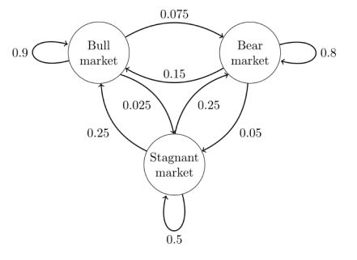

# 🔥 Markov Chain overview and their implementation in Finance
Data scientist | [Anass MAJJI](https://www.linkedin.com/in/anass-majji-729773157/)
***

In this project, we highlight the main theorems of Markov Chain and their application in Finance espacially in predicting market trends. 

 

# 🚀 Repository Structure

- **README.md :** The top level README for reviewers of this project.
- **Images :**  The folder contains images used on the notebook. 
- **Markov Chain.ipynb :** a notebook that details Markov Chain theorems with their demonstrations with an example of implementation in Finance especially in predicting Market Trends. 

# :mailbox_closed: Contact
For any information, feedback or questions, please [contact me][anass-email]

[anass-email]: mailto:anassmajji34@gmail.com

